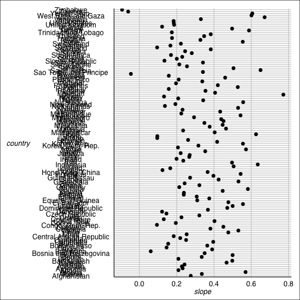
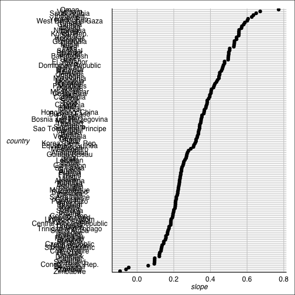
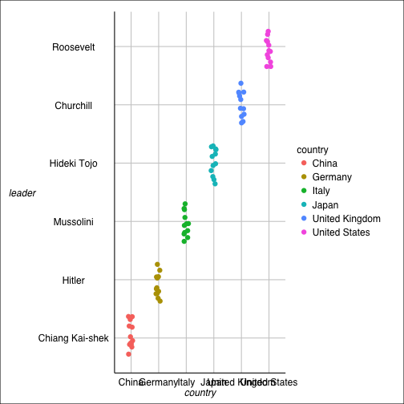
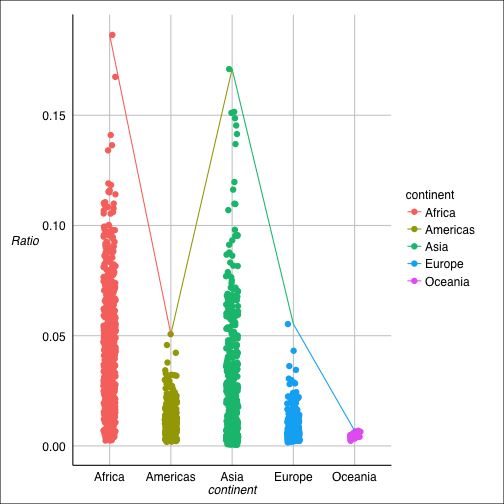
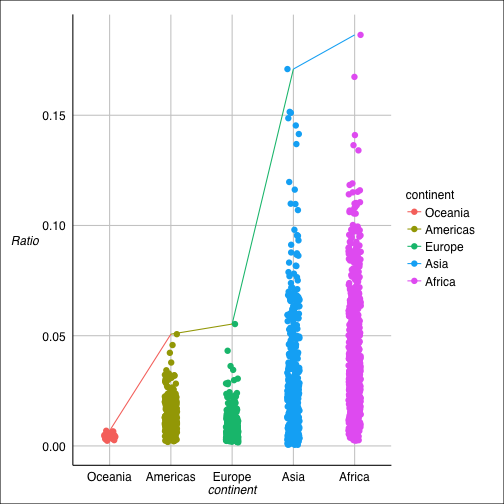

In this assignment, we will continue to explore the data set [Gapminder excerpt](http://www.stat.ubc.ca/~jenny/notOcto/STAT545A/examples/gapminder/data/gapminderDataFiveYear.txt). 

# Preparation

Before preceeding to the exciting parts, we need some preparation like loading the data and library.


```r
# load the data
gdURL <-"http://tiny.cc/gapminder"
gDat <- read.delim(file = gdURL)

# load the library
library(plyr)
suppressPackageStartupMessages(library(dplyr))
library(ggplot2)
library(ggthemes)
library(knitr)
```


# Drop Oceania
Now we will filter the Gapminder data to remove everything associated with the continent of Oceania. Before droping, we will have a look at some basic facts of the dataset.

```r
# before droping Oceania
nlevels(gDat$continent)
```

```
## [1] 5
```

```r
levels(gDat$continent)
```

```
## [1] "Africa"   "Americas" "Asia"     "Europe"   "Oceania"
```

```r
nrow(gDat$continent)
```

```
## NULL
```

Then drop Oceania by `filter` and also correct the level of factors by `droplevels`.

```r
# drop Oceania
hDat<- gDat %>%
  filter(continent != "Oceania")

iDat  <- hDat %>% droplevels
nlevels(iDat$continent)
```

```
## [1] 4
```

```r
levels(iDat$continent)
```

```
## [1] "Africa"   "Americas" "Asia"     "Europe"
```

```r
nrow(gDat$continent)
```

```
## NULL
```
We can see that the number of rows and levels decrease and the level no longer include `Oceania`.


# Model life expectancy as a function of year
For each country, retain estimated intercept and slope from a linear fit – regressing life expectancy on year.

```r
j_coefs <- ddply(gDat, ~ country + continent, function(dat, offset = 1952) {
  the_fit <- lm(lifeExp ~ I(year - offset), dat)
  setNames(coef(the_fit), c("intercept", "slope"))
})
```

Then a basic characterization and description of the j_coef object are as follows:

```r
str(j_coefs)
```

```
## 'data.frame':	142 obs. of  4 variables:
##  $ country  : Factor w/ 142 levels "Afghanistan",..: 1 2 3 4 5 6 7 8 9 10 ...
##  $ continent: Factor w/ 5 levels "Africa","Americas",..: 3 4 1 1 2 5 4 3 3 4 ...
##  $ intercept: num  29.9 59.2 43.4 32.1 62.7 ...
##  $ slope    : num  0.275 0.335 0.569 0.209 0.232 ...
```

```r
names(j_coefs)
```

```
## [1] "country"   "continent" "intercept" "slope"
```

```r
head(j_coefs)
```

```
##       country continent intercept  slope
## 1 Afghanistan      Asia     29.91 0.2753
## 2     Albania    Europe     59.23 0.3347
## 3     Algeria    Africa     43.37 0.5693
## 4      Angola    Africa     32.13 0.2093
## 5   Argentina  Americas     62.69 0.2317
## 6   Australia   Oceania     68.40 0.2277
```

# Order of data vs. order of factor levels
Consider post_arrange, post_reorder, and post_both as defined below.

```r
post_arrange <- j_coefs %>% arrange(slope)
post_reorder <- j_coefs %>%
  mutate(country = reorder(country, slope))
post_both <- j_coefs %>%
  mutate(country = reorder(country, slope)) %>%
  arrange(country)
```

For `post_arrange`, the data is arranged by `slope`. For `post_reorder`, the order of level of country is set to be the value of `slope`. For `post_both`, the order of level of country is set to be the value of `slope` and then the data is arranged by `country`. Thus 
`post_arrange` and `post_both` should be the same while in `post_reorder` dataset is not arranged. The following codes and plots show this fact.


```r
identical(post_arrange, post_reorder)
```

```
## [1] FALSE
```

```r
identical(post_both, post_reorder)
```

```
## [1] FALSE
```

```r
identical(post_arrange, post_both)
```

```
## [1] FALSE
```

```r
ggplot(post_arrange, aes(x = slope, y = country)) + 
  geom_point(size = 3) + theme_gdocs()
```

 

```r
ggplot(post_reorder, aes(x = slope, y = country)) + 
  geom_point(size = 3) + theme_gdocs()
```

 

```r
ggplot(post_both, aes(x = slope, y = country)) + 
  geom_point(size = 3) + theme_gdocs()
```

 

# Revalue a factor
Here I choose six main countries in WWII and add a variable `leader` for the leader in WWII by revaluing the factor `country`.

```r
h_countries <- c("Italy", "Germany", "Japan", "United Kingdom","United States", "China")
hDat <- gDat %>%
  filter(country %in% h_countries) %>% 
  droplevels
hDat <- hDat %>%
  mutate(leader =revalue(hDat$country, c("Italy" = "Mussolini", 
            "Germany" = "Hitler", 
            "Japan" = "Hideki Tojo", 
            "United Kingdom" = "Churchill",
            "United States" = "Roosevelt", 
            "China" = "Chiang Kai-shek")))

kable(hDat)
```

```
## 
## 
## |country        | year|       pop|continent | lifeExp| gdpPercap|leader          |
## |:--------------|----:|---------:|:---------|-------:|---------:|:---------------|
## |China          | 1952| 5.563e+08|Asia      |   44.00|     400.4|Chiang Kai-shek |
## |China          | 1957| 6.374e+08|Asia      |   50.55|     576.0|Chiang Kai-shek |
## |China          | 1962| 6.658e+08|Asia      |   44.50|     487.7|Chiang Kai-shek |
## |China          | 1967| 7.546e+08|Asia      |   58.38|     612.7|Chiang Kai-shek |
## |China          | 1972| 8.620e+08|Asia      |   63.12|     676.9|Chiang Kai-shek |
## |China          | 1977| 9.435e+08|Asia      |   63.97|     741.2|Chiang Kai-shek |
## |China          | 1982| 1.000e+09|Asia      |   65.53|     962.4|Chiang Kai-shek |
## |China          | 1987| 1.084e+09|Asia      |   67.27|    1378.9|Chiang Kai-shek |
## |China          | 1992| 1.165e+09|Asia      |   68.69|    1655.8|Chiang Kai-shek |
## |China          | 1997| 1.230e+09|Asia      |   70.43|    2289.2|Chiang Kai-shek |
## |China          | 2002| 1.280e+09|Asia      |   72.03|    3119.3|Chiang Kai-shek |
## |China          | 2007| 1.319e+09|Asia      |   72.96|    4959.1|Chiang Kai-shek |
## |Germany        | 1952| 6.915e+07|Europe    |   67.50|    7144.1|Hitler          |
## |Germany        | 1957| 7.102e+07|Europe    |   69.10|   10187.8|Hitler          |
## |Germany        | 1962| 7.374e+07|Europe    |   70.30|   12902.5|Hitler          |
## |Germany        | 1967| 7.637e+07|Europe    |   70.80|   14745.6|Hitler          |
## |Germany        | 1972| 7.872e+07|Europe    |   71.00|   18016.2|Hitler          |
## |Germany        | 1977| 7.816e+07|Europe    |   72.50|   20512.9|Hitler          |
## |Germany        | 1982| 7.834e+07|Europe    |   73.80|   22031.5|Hitler          |
## |Germany        | 1987| 7.772e+07|Europe    |   74.85|   24639.2|Hitler          |
## |Germany        | 1992| 8.060e+07|Europe    |   76.07|   26505.3|Hitler          |
## |Germany        | 1997| 8.201e+07|Europe    |   77.34|   27788.9|Hitler          |
## |Germany        | 2002| 8.235e+07|Europe    |   78.67|   30035.8|Hitler          |
## |Germany        | 2007| 8.240e+07|Europe    |   79.41|   32170.4|Hitler          |
## |Italy          | 1952| 4.767e+07|Europe    |   65.94|    4931.4|Mussolini       |
## |Italy          | 1957| 4.918e+07|Europe    |   67.81|    6248.7|Mussolini       |
## |Italy          | 1962| 5.084e+07|Europe    |   69.24|    8243.6|Mussolini       |
## |Italy          | 1967| 5.267e+07|Europe    |   71.06|   10022.4|Mussolini       |
## |Italy          | 1972| 5.437e+07|Europe    |   72.19|   12269.3|Mussolini       |
## |Italy          | 1977| 5.606e+07|Europe    |   73.48|   14256.0|Mussolini       |
## |Italy          | 1982| 5.654e+07|Europe    |   74.98|   16537.5|Mussolini       |
## |Italy          | 1987| 5.673e+07|Europe    |   76.42|   19207.2|Mussolini       |
## |Italy          | 1992| 5.684e+07|Europe    |   77.44|   22013.6|Mussolini       |
## |Italy          | 1997| 5.748e+07|Europe    |   78.82|   24675.0|Mussolini       |
## |Italy          | 2002| 5.793e+07|Europe    |   80.24|   27968.1|Mussolini       |
## |Italy          | 2007| 5.815e+07|Europe    |   80.55|   28569.7|Mussolini       |
## |Japan          | 1952| 8.646e+07|Asia      |   63.03|    3217.0|Hideki Tojo     |
## |Japan          | 1957| 9.156e+07|Asia      |   65.50|    4317.7|Hideki Tojo     |
## |Japan          | 1962| 9.583e+07|Asia      |   68.73|    6576.6|Hideki Tojo     |
## |Japan          | 1967| 1.008e+08|Asia      |   71.43|    9847.8|Hideki Tojo     |
## |Japan          | 1972| 1.072e+08|Asia      |   73.42|   14778.8|Hideki Tojo     |
## |Japan          | 1977| 1.139e+08|Asia      |   75.38|   16610.4|Hideki Tojo     |
## |Japan          | 1982| 1.185e+08|Asia      |   77.11|   19384.1|Hideki Tojo     |
## |Japan          | 1987| 1.221e+08|Asia      |   78.67|   22375.9|Hideki Tojo     |
## |Japan          | 1992| 1.243e+08|Asia      |   79.36|   26824.9|Hideki Tojo     |
## |Japan          | 1997| 1.260e+08|Asia      |   80.69|   28816.6|Hideki Tojo     |
## |Japan          | 2002| 1.271e+08|Asia      |   82.00|   28604.6|Hideki Tojo     |
## |Japan          | 2007| 1.275e+08|Asia      |   82.60|   31656.1|Hideki Tojo     |
## |United Kingdom | 1952| 5.043e+07|Europe    |   69.18|    9979.5|Churchill       |
## |United Kingdom | 1957| 5.143e+07|Europe    |   70.42|   11283.2|Churchill       |
## |United Kingdom | 1962| 5.329e+07|Europe    |   70.76|   12477.2|Churchill       |
## |United Kingdom | 1967| 5.496e+07|Europe    |   71.36|   14142.9|Churchill       |
## |United Kingdom | 1972| 5.608e+07|Europe    |   72.01|   15895.1|Churchill       |
## |United Kingdom | 1977| 5.618e+07|Europe    |   72.76|   17428.7|Churchill       |
## |United Kingdom | 1982| 5.634e+07|Europe    |   74.04|   18232.4|Churchill       |
## |United Kingdom | 1987| 5.698e+07|Europe    |   75.01|   21664.8|Churchill       |
## |United Kingdom | 1992| 5.787e+07|Europe    |   76.42|   22705.1|Churchill       |
## |United Kingdom | 1997| 5.881e+07|Europe    |   77.22|   26074.5|Churchill       |
## |United Kingdom | 2002| 5.991e+07|Europe    |   78.47|   29479.0|Churchill       |
## |United Kingdom | 2007| 6.078e+07|Europe    |   79.42|   33203.3|Churchill       |
## |United States  | 1952| 1.576e+08|Americas  |   68.44|   13990.5|Roosevelt       |
## |United States  | 1957| 1.720e+08|Americas  |   69.49|   14847.1|Roosevelt       |
## |United States  | 1962| 1.865e+08|Americas  |   70.21|   16173.1|Roosevelt       |
## |United States  | 1967| 1.987e+08|Americas  |   70.76|   19530.4|Roosevelt       |
## |United States  | 1972| 2.099e+08|Americas  |   71.34|   21806.0|Roosevelt       |
## |United States  | 1977| 2.202e+08|Americas  |   73.38|   24072.6|Roosevelt       |
## |United States  | 1982| 2.322e+08|Americas  |   74.65|   25009.6|Roosevelt       |
## |United States  | 1987| 2.428e+08|Americas  |   75.02|   29884.4|Roosevelt       |
## |United States  | 1992| 2.569e+08|Americas  |   76.09|   32003.9|Roosevelt       |
## |United States  | 1997| 2.729e+08|Americas  |   76.81|   35767.4|Roosevelt       |
## |United States  | 2002| 2.877e+08|Americas  |   77.31|   39097.1|Roosevelt       |
## |United States  | 2007| 3.011e+08|Americas  |   78.24|   42951.7|Roosevelt       |
```
Following table and plot provide clear proof that my new factor `leader` is a revalued version of `country`.

```r
kable(hDat[,c(1,7)])
```

```
## 
## 
## |country        |leader          |
## |:--------------|:---------------|
## |China          |Chiang Kai-shek |
## |China          |Chiang Kai-shek |
## |China          |Chiang Kai-shek |
## |China          |Chiang Kai-shek |
## |China          |Chiang Kai-shek |
## |China          |Chiang Kai-shek |
## |China          |Chiang Kai-shek |
## |China          |Chiang Kai-shek |
## |China          |Chiang Kai-shek |
## |China          |Chiang Kai-shek |
## |China          |Chiang Kai-shek |
## |China          |Chiang Kai-shek |
## |Germany        |Hitler          |
## |Germany        |Hitler          |
## |Germany        |Hitler          |
## |Germany        |Hitler          |
## |Germany        |Hitler          |
## |Germany        |Hitler          |
## |Germany        |Hitler          |
## |Germany        |Hitler          |
## |Germany        |Hitler          |
## |Germany        |Hitler          |
## |Germany        |Hitler          |
## |Germany        |Hitler          |
## |Italy          |Mussolini       |
## |Italy          |Mussolini       |
## |Italy          |Mussolini       |
## |Italy          |Mussolini       |
## |Italy          |Mussolini       |
## |Italy          |Mussolini       |
## |Italy          |Mussolini       |
## |Italy          |Mussolini       |
## |Italy          |Mussolini       |
## |Italy          |Mussolini       |
## |Italy          |Mussolini       |
## |Italy          |Mussolini       |
## |Japan          |Hideki Tojo     |
## |Japan          |Hideki Tojo     |
## |Japan          |Hideki Tojo     |
## |Japan          |Hideki Tojo     |
## |Japan          |Hideki Tojo     |
## |Japan          |Hideki Tojo     |
## |Japan          |Hideki Tojo     |
## |Japan          |Hideki Tojo     |
## |Japan          |Hideki Tojo     |
## |Japan          |Hideki Tojo     |
## |Japan          |Hideki Tojo     |
## |Japan          |Hideki Tojo     |
## |United Kingdom |Churchill       |
## |United Kingdom |Churchill       |
## |United Kingdom |Churchill       |
## |United Kingdom |Churchill       |
## |United Kingdom |Churchill       |
## |United Kingdom |Churchill       |
## |United Kingdom |Churchill       |
## |United Kingdom |Churchill       |
## |United Kingdom |Churchill       |
## |United Kingdom |Churchill       |
## |United Kingdom |Churchill       |
## |United Kingdom |Churchill       |
## |United States  |Roosevelt       |
## |United States  |Roosevelt       |
## |United States  |Roosevelt       |
## |United States  |Roosevelt       |
## |United States  |Roosevelt       |
## |United States  |Roosevelt       |
## |United States  |Roosevelt       |
## |United States  |Roosevelt       |
## |United States  |Roosevelt       |
## |United States  |Roosevelt       |
## |United States  |Roosevelt       |
## |United States  |Roosevelt       |
```

```r
ggplot(hDat, aes(x = country, y = leader, group = 1,color = country)) +
  geom_jitter(size = 3, position = position_jitter(width = .1)) +
  theme_gdocs()
```

 

# Reorder a factor
Here I choose the factor continent and reorder this factor by max of ratio of lifeExp over gdpPercap.

```r
jDat <- gDat %>%
  mutate(continent = reorder(continent, lifeExp/gdpPercap, max))
```
This is the plot before reordering.

```r
p <- ggplot(gDat, aes(x = continent, y = (lifeExp/gdpPercap), group = 1,color = continent))
p + geom_jitter(size = 3, position = position_jitter(width = .1)) +
  labs(y = "Ratio")+
  stat_summary(fun.y = max, geom = "path") +
  theme_gdocs()
```

 
This is the plot after reordering.

```r
p <- ggplot(jDat, aes(x = continent, y = (lifeExp/gdpPercap), group = 1,color = continent))
p + geom_jitter(size = 3, position = position_jitter(width = .1)) +
  stat_summary(fun.y = max, geom = "path")+
  labs(y = "Ratio")+
  theme_gdocs()
```

 

# Write and read data to file
Here we will cover 3 method of writing and reading data to file:

* `write.table()` + `read.table()`
* `saveRDS()` + `readRDS()`
* `dput()` + `dget()`

We will use data `hDat` with new factor `leader`.

For `write.table()` + `read.table()`:

```r
write.table(hDat, "hDat.cvs", sep = ",", row.names = FALSE,
            quote = FALSE)
readhDat<-read.table("hDat.cvs",sep = ",", header = TRUE)
identical(hDat, readhDat)
```

```
## [1] FALSE
```

Notice that the outcome of comparing input and output is `FALSE`. This is because the factor `leader` is a revalue of `country`, which is lost during writing and reading. Thus following operator is required.

```r
readhDat <- readhDat %>%
  mutate(leader =revalue(hDat$country, c("Italy" = "Mussolini", 
                                         "Germany" = "Hitler", 
                                         "Japan" = "Hideki Tojo", 
                                         "United Kingdom" = "Churchill",
                                         "United States" = "Roosevelt", 
                                         "China" = "Chiang Kai-shek")))
identical(hDat, readhDat)
```

```
## [1] TRUE
```
Then it works well.

For `saveRDS()` + `readRDS()` and `dput()` + `dget()`, things turn out to be simple.

```r
saveRDS(hDat, "hDat.rds")
hDatRDS <- readRDS("hDat.rds")
identical(hDat, hDatRDS)
```

```
## [1] TRUE
```

```r
dput(hDat, "hDat-dput.txt")
hDatPut <- dget("hDat-dput.txt")
identical(hDat, hDatPut)
```

```
## [1] TRUE
```

# Play with the `factor(, ... levels = ...)` function
* Experiment with using stringsAsFactors = FALSE in read.table() followed by an explicit call to factor(). 

```r
readhDat.wf<-read.table("hDat.cvs",sep = ",", header = TRUE,stringsAsFactors = FALSE)
str(readhDat.wf)
```

```
## 'data.frame':	72 obs. of  7 variables:
##  $ country  : chr  "China" "China" "China" "China" ...
##  $ year     : int  1952 1957 1962 1967 1972 1977 1982 1987 1992 1997 ...
##  $ pop      : num  5.56e+08 6.37e+08 6.66e+08 7.55e+08 8.62e+08 ...
##  $ continent: chr  "Asia" "Asia" "Asia" "Asia" ...
##  $ lifeExp  : num  44 50.5 44.5 58.4 63.1 ...
##  $ gdpPercap: num  400 576 488 613 677 ...
##  $ leader   : chr  "Chiang Kai-shek" "Chiang Kai-shek" "Chiang Kai-shek" "Chiang Kai-shek" ...
```
Now variables country, continent and leader is char, no longer factor. The way to change them into factor is to use function `factor`. 

```r
readhDat.wf$country = factor(readhDat.wf$country)
readhDat.wf$continent = factor(readhDat.wf$continent)
readhDat.wf$leader = factor(readhDat.wf$leader)
str(readhDat.wf)
```

```
## 'data.frame':	72 obs. of  7 variables:
##  $ country  : Factor w/ 6 levels "China","Germany",..: 1 1 1 1 1 1 1 1 1 1 ...
##  $ year     : int  1952 1957 1962 1967 1972 1977 1982 1987 1992 1997 ...
##  $ pop      : num  5.56e+08 6.37e+08 6.66e+08 7.55e+08 8.62e+08 ...
##  $ continent: Factor w/ 3 levels "Americas","Asia",..: 2 2 2 2 2 2 2 2 2 2 ...
##  $ lifeExp  : num  44 50.5 44.5 58.4 63.1 ...
##  $ gdpPercap: num  400 576 488 613 677 ...
##  $ leader   : Factor w/ 6 levels "Chiang Kai-shek",..: 1 1 1 1 1 1 1 1 1 1 ...
```
Now everything seems all right.

* apply factor levels from one version of a factor to another
Here we reorder country based on max of lifeExp in hDat THEN apply those factor levels back to country in the readhDat.wf.

```r
hDat.order <- hDat %>%
  mutate(country = reorder(country, lifeExp, max))
```
Before application:

```r
levels(readhDat.wf$country)
```

```
## [1] "China"          "Germany"        "Italy"          "Japan"         
## [5] "United Kingdom" "United States"
```

After application:

```r
readhDat.wf$country = factor(readhDat.wf$country, level = levels(hDat.order$country))
levels(readhDat.wf$country)
```

```
## [1] "China"          "United States"  "Germany"        "United Kingdom"
## [5] "Italy"          "Japan"
```

# My experience and workflow

1. Reordering a factor is quite a new suject to me. It seems strange in the beginning but turns out to be very useful. For example, reordering factor variable can make plot more readable.
2. It takes me quite long to figure out why the result of comparing input and output by `write.table()`+`read.table()` is `FALSE`. This is because the factor `leader` is a revalue of `country`, which is lost during writing and reading. I think `saveRDS()` + `readRDS()` and `dput()` + `dget()` are better ways to keep all the information in data.
