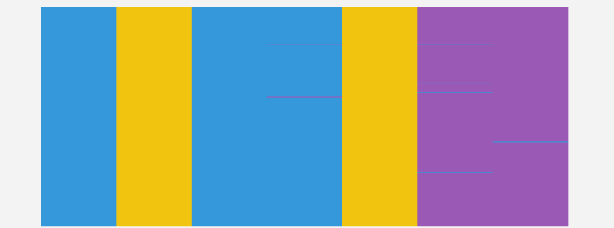

In this assignment, we begin to explore the data set [Gapminder excerpt](http://www.stat.ubc.ca/~jenny/notOcto/STAT545A/examples/gapminder/data/gapminderDataFiveYear.txt). 

# Bring rectangular data in
First we want to load the data from local files using two different functions.


```{r}
gdURL <-"http://tiny.cc/gapminder"
gDat <- read.delim(file = gdURL)
```

```{r, eval = FALSE}
gDat <- read.table(file = gdURL)
```
The first command with `read.delim` read the data successfully, while the second one with `read.table` brings the following error message:

```
error in scan(file, what, nmax, sep, dec, quote, skip, nlines, na.strings,  :
no 6th element in line 145
```

To make two function have the same results, we make the following changing to the second command:

```{r, eval = FALSE}
gDat <-read.table(file = gdURL, header = TRUE, sep = "\t", quote = "\"")
```

The arguments are explained as follows:

* `header = TRUE` means the dataset's first line is a header line, which contains names of each column;
*  `sep= "\t"` means the dataset is separated by _tab_;
*   `quote = "\""`means the quotation is limited to the case that the words inside `""`. If such argument is missing, the default `quote` option is `"\""`, which also read words inside `''` as quotation. Some problems will arise while reading the entry `Cote d'Ivoire`.

# Smell test the data
Now we will start to explore some basic features of the data set.

1. Is it a data.frame, a matrix, a vector, a list?
```{r}
class(gDat)
```
Thus it is a data.frame.

2. What’s its mode, class?
```{r}
mode(gDat)
class(gDat)
```
Thus its mode is a list and its class is a data.frame.

3. How many variables?
```{r}
ncol(gDat)
names(gDat)
```
It has 6 variables: "country"   "year"      "pop"       "continent" "lifeExp"   "gdpPercap".

4. How many rows/observations?
```{r}
nrow(gDat)
```
There are 1704 observations in total.

5. Can you get these facts about “extent” or “size” in more than one way? Can you imagine different functions being useful in different contexts?
There indeed several other ways to get these facts. For example, if we want the number of columns and rows in one command, we can use function `dim`.

```{r}
dim(gDat)
```

Other functions include but are not limited to as follows:
```{r}
length(gDat)
colnames(gDat)
```

6. What flavor is each the variable?
The function `str` will give us all the information about the flavors of variables.
```{r}
str(gDat)
```

# Explore individual variables
Now we will pick at one categorical variable and at one quantitiative variable to explore, and then answer following question.

1. Characterize what’s possible, i.e. all possible values or max vs. min … whatever’s appropriate.
2. What’s typical? What’s the spread? What’s the distribution? Etc., tailored to the variable at hand.

We begin with the quantitiative variable _lifeExp_. First we have a belief veiw about this variable.
```{r}
LE<-gDat$lifeExp
class(LE)
summary(LE)
```

Also following plots will help us understand this variable better
```{r}
library(ggplot2)
library(ggthemes)
# histogram of lifeExp
ggplot(data=gDat,aes(x=lifeExp))+geom_histogram(aes(fill = ..count..))+theme_gdocs()

# boxplot comparing lifeexp in different continents
ggplot(data=gDat,aes(continent,lifeExp))+geom_boxplot(aes(fill = continent))+theme_gdocs()

# density plot of lifeexp in different continents
ggplot(gDat, aes(x=lifeExp, color=continent))+geom_density()+theme_gdocs()

# points plot of lifeexp vs year
ggplot(gDat, aes(x = year, y = lifeExp))+geom_point(aes(colour = factor( continent),shape = factor( continent)), alpha = 0.6, position = 'jitter')+theme_gdocs()

# a more clear ponit plot of lifeexp vs year seperated by continent
ggplot(gDat, aes(x = year, y = lifeExp)) + geom_point(aes(color = continent))+facet_wrap(~ continent) + geom_smooth(method = "lm")+theme_gdocs()
```

```{r}
stem(LE)
```
The stem plot gives us the distribution of the occurance of the number of variable _lifeExp_.
```{r}
ggplot(gDat, aes(sample=lifeExp)) +stat_qq(alpha = 0.5) +facet_wrap(~ continent)+theme_gdocs()
```
The QQ plot tells us the distribution of the variable in each continent is approximate normal.


For the categorical variable, we choice _continent_. First we have a belief veiw about this variable.
```{r}
Con<-gDat$continent
class(Con)
levels(Con)
summary(Con)
```
Following two plots, barplot and pieplot give us a basic view about the distribution of the the variable.
```{r}
# histogram(ae of continent
ggplot(gDat, aes(x = continent)) + geom_histogram(aes(fill = continent)) +  theme_gdocs()

# pie plot of continent
ggplot(gDat)+geom_bar(aes(x=factor(1), fill=continent))+coord_polar(theta="y")
```


# My experience and workflow
* When comparing `read.table` and `read.delim`, it really take me some time about the option `quote` and the difference it cause. However, help document of R help me solve this question
```{r, eval = FALSE}
?read.table
read.table(file, header = FALSE, sep = "", quote = "\"'", dec = ".", 
           numerals = c("allow.loss", "warn.loss", "no.loss"), row.names, col.names, 
           as.is = !stringsAsFactors, na.strings = "NA", colClasses = NA, nrows = -1,
           skip = 0, check.names = TRUE, fill = !blank.lines.skip, strip.white = FALSE,
           blank.lines.skip = TRUE, comment.char = "#", allowEscapes = FALSE, flush =
             FALSE, stringsAsFactors = default.stringsAsFactors(), fileEncoding = "",
           encoding = "unknown", text, skipNul = FALSE)

read.csv(file, header = TRUE, sep = ",", quote = "\"",
         dec = ".", fill = TRUE, comment.char = "", ...)

read.csv2(file, header = TRUE, sep = ";", quote = "\"",
          dec = ",", fill = TRUE, comment.char = "", ...)

read.delim(file, header = TRUE, sep = "\t", quote = "\"",
           dec = ".", fill = TRUE, comment.char = "", ...)

read.delim2(file, header = TRUE, sep = "\t", quote = "\"",
            dec = ",", fill = TRUE, comment.char = "", ...)
```
It would be helpful of reading all the default option carefully.

* This is the first time I use `ggplot`, and it really take some time to get familiar with it. One thing I have to talk about is the pie plot. In fact, there is not function for pie plot in ggplot. However, after understading pie plot is in fact the histogram in polar coord, we can easily write the code as follows: 
```{r, eval = FALSE}
# pie plot of continent
ggplot(gDat)+geom_bar(aes(x=factor(1), fill=continent))+coord_polar(theta="y")
```

* The beauty of the graph is always our concern. Here I recommand everyone the package `ggthemes`. It provide us a lot of theme to make the graph beautiful. In this assignment, I use the theme `gdoc`, which turns the graph to the sytle of google document.

* I also do some extra work using [csv-fingerprints](http://setosa.io/blog/2014/08/03/csv-fingerprints/), and have the follow result:

