In this assignment, we will continue to explore the data set [Gapminder excerpt](http://www.stat.ubc.ca/~jenny/notOcto/STAT545A/examples/gapminder/data/gapminderDataFiveYear.txt). 

# Preparation

Before preceeding to the exciting parts, we need some preparation like loading the data and library.


```r
# load the data
gdURL <-"http://tiny.cc/gapminder"
gDat <- read.delim(file = gdURL)

# load the library
library(dplyr)
library(ggplot2)
library(ggthemes)
library(knitr)
library(reshape2)

# change data.frame to tbl_df 
gtbl <- tbl_df(gDat)
glimpse(gtbl)
```

```
## Variables:
## $ country   (fctr) Afghanistan, Afghanistan, Afghanistan, Afghanistan,...
## $ year      (int) 1952, 1957, 1962, 1967, 1972, 1977, 1982, 1987, 1992...
## $ pop       (dbl) 8425333, 9240934, 10267083, 11537966, 13079460, 1488...
## $ continent (fctr) Asia, Asia, Asia, Asia, Asia, Asia, Asia, Asia, Asi...
## $ lifeExp   (dbl) 28.80, 30.33, 32.00, 34.02, 36.09, 38.44, 39.85, 40....
## $ gdpPercap (dbl) 779.4, 820.9, 853.1, 836.2, 740.0, 786.1, 978.0, 852...
```

# Our exploration
* TASK NO.1: Get the maximum and minimum of GDP per capita for all continents.

```r
# Get the maximum and minimum of GDP per capita for all continents.
gdp_int <- gtbl %>%
  group_by(continent) %>%
  summarize(min_gdpPercap = min(gdpPercap), max_gdpPercap = max(gdpPercap))

# resharp the data for plot
gdp_int.r = melt(gdp_int)
```

```
## Using continent as id variables
```

<table class='container'><tr><td>

<table>
<thead>
<tr class="header">
<th align="left">continent</th>
<th align="right">min_gdpPercap</th>
<th align="right">max_gdpPercap</th>
</tr>
</thead>
<tbody>
<tr class="odd">
<td align="left">Africa</td>
<td align="right">241.2</td>
<td align="right">21951</td>
</tr>
<tr class="even">
<td align="left">Americas</td>
<td align="right">1201.6</td>
<td align="right">42952</td>
</tr>
<tr class="odd">
<td align="left">Asia</td>
<td align="right">331.0</td>
<td align="right">113523</td>
</tr>
<tr class="even">
<td align="left">Europe</td>
<td align="right">973.5</td>
<td align="right">49357</td>
</tr>
<tr class="odd">
<td align="left">Oceania</td>
<td align="right">10039.6</td>
<td align="right">34435</td>
</tr>
</tbody>
</table>
</td><td>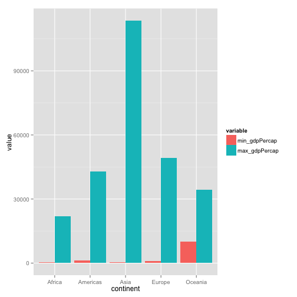</td></tr></table>

* TASK NO.2: Look at the spread of GDP per capita within the continents.


```r
# first we look at the range of gdp
gdp_spread <- gtbl %>%
  group_by(continent) %>%
  summarize(spread_gdpPercap = max(gdpPercap)-min(gdpPercap))
```

<table class='container'><tr><td>

<table>
<thead>
<tr class="header">
<th align="left">continent</th>
<th align="right">spread_gdpPercap</th>
</tr>
</thead>
<tbody>
<tr class="odd">
<td align="left">Africa</td>
<td align="right">21710</td>
</tr>
<tr class="even">
<td align="left">Americas</td>
<td align="right">41750</td>
</tr>
<tr class="odd">
<td align="left">Asia</td>
<td align="right">113192</td>
</tr>
<tr class="even">
<td align="left">Europe</td>
<td align="right">48384</td>
</tr>
<tr class="odd">
<td align="left">Oceania</td>
<td align="right">24396</td>
</tr>
</tbody>
</table>
</td><td>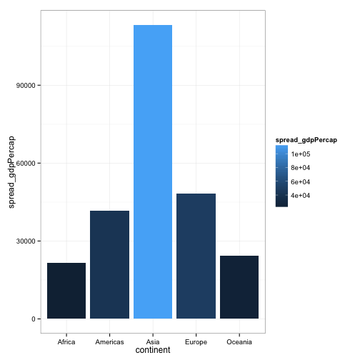</td></tr></table>


```r
#  Then look at the sd and iqr of the data of GDP per capita within the continents. 
gdp_spread2 <- gtbl %>%
  group_by(continent) %>%
  summarize(sd_gdp = sd(gdpPercap), iqr_gdp = IQR(gdpPercap))
gdp_spread2.r = melt(gdp_spread2)
```

```
## Using continent as id variables
```

<table class='container'><tr><td>

<table>
<thead>
<tr class="header">
<th align="left">continent</th>
<th align="right">sd_gdp</th>
<th align="right">iqr_gdp</th>
</tr>
</thead>
<tbody>
<tr class="odd">
<td align="left">Africa</td>
<td align="right">2828</td>
<td align="right">1616</td>
</tr>
<tr class="even">
<td align="left">Americas</td>
<td align="right">6397</td>
<td align="right">4402</td>
</tr>
<tr class="odd">
<td align="left">Asia</td>
<td align="right">14045</td>
<td align="right">7492</td>
</tr>
<tr class="even">
<td align="left">Europe</td>
<td align="right">9355</td>
<td align="right">13248</td>
</tr>
<tr class="odd">
<td align="left">Oceania</td>
<td align="right">6359</td>
<td align="right">8072</td>
</tr>
</tbody>
</table>
</td><td>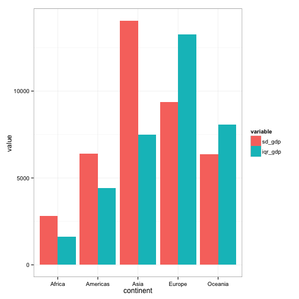</td></tr></table>


```r
# also box plot is a good way to see the spread of data
ggplot(gtbl, aes(continent, gdpPercap))+
  geom_boxplot(aes(fill = continent), outlier.shape = NA)+
  geom_jitter(alpha = 0.1, position = position_jitter(width = 0.1))+
  xlab("Continent")+
  ylab("GDP per capita")+
  ylim(c(0,5e4))+
  theme_bw()
```

```
## Warning: Removed 6 rows containing non-finite values (stat_boxplot).
## Warning: Removed 64 rows containing missing values (geom_point).
## Warning: Removed 25 rows containing missing values (geom_point).
## Warning: Removed 45 rows containing missing values (geom_point).
## Warning: Removed 4 rows containing missing values (geom_point).
## Warning: Removed 1 rows containing missing values (geom_point).
## Warning: Removed 6 rows containing missing values (geom_point).
```

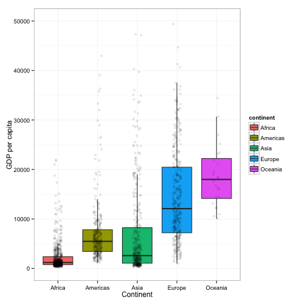 

* TASK NO.3: Compute a trimmed mean of life expectancy for different years. Or a weighted mean, weighting by population. 

```r
# Compute 90% trimmed mean of life expectancy for different years.
lifeExp_tmean <- gtbl %>%
  group_by(year) %>%
  summarize(tmean_lifeExp= mean(lifeExp,trim = 0.05))
```

<table class='container'><tr><td>

<table>
<thead>
<tr class="header">
<th align="right">year</th>
<th align="right">tmean_lifeExp</th>
</tr>
</thead>
<tbody>
<tr class="odd">
<td align="right">1952</td>
<td align="right">48.85</td>
</tr>
<tr class="even">
<td align="right">1957</td>
<td align="right">51.42</td>
</tr>
<tr class="odd">
<td align="right">1962</td>
<td align="right">53.64</td>
</tr>
<tr class="even">
<td align="right">1967</td>
<td align="right">55.80</td>
</tr>
<tr class="odd">
<td align="right">1972</td>
<td align="right">57.85</td>
</tr>
<tr class="even">
<td align="right">1977</td>
<td align="right">59.89</td>
</tr>
<tr class="odd">
<td align="right">1982</td>
<td align="right">61.85</td>
</tr>
<tr class="even">
<td align="right">1987</td>
<td align="right">63.61</td>
</tr>
<tr class="odd">
<td align="right">1992</td>
<td align="right">64.81</td>
</tr>
<tr class="even">
<td align="right">1997</td>
<td align="right">65.56</td>
</tr>
<tr class="odd">
<td align="right">2002</td>
<td align="right">66.20</td>
</tr>
<tr class="even">
<td align="right">2007</td>
<td align="right">67.56</td>
</tr>
</tbody>
</table>
</td><td>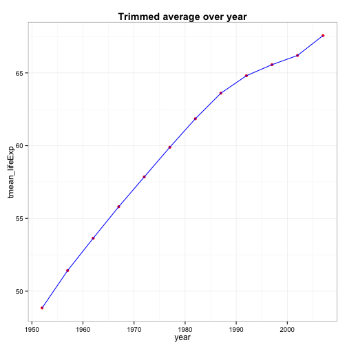</td></tr></table>


```r
# a weighted mean, weighting by population. 
lifeExp_wmean <- gtbl %>%
  group_by(year) %>%
  summarize(wmean_lifeExp= weighted.mean(lifeExp,pop))
```

<table class='container'><tr><td>

<table>
<thead>
<tr class="header">
<th align="right">year</th>
<th align="right">wmean_lifeExp</th>
</tr>
</thead>
<tbody>
<tr class="odd">
<td align="right">1952</td>
<td align="right">48.94</td>
</tr>
<tr class="even">
<td align="right">1957</td>
<td align="right">52.12</td>
</tr>
<tr class="odd">
<td align="right">1962</td>
<td align="right">52.32</td>
</tr>
<tr class="even">
<td align="right">1967</td>
<td align="right">56.98</td>
</tr>
<tr class="odd">
<td align="right">1972</td>
<td align="right">59.51</td>
</tr>
<tr class="even">
<td align="right">1977</td>
<td align="right">61.24</td>
</tr>
<tr class="odd">
<td align="right">1982</td>
<td align="right">62.88</td>
</tr>
<tr class="even">
<td align="right">1987</td>
<td align="right">64.42</td>
</tr>
<tr class="odd">
<td align="right">1992</td>
<td align="right">65.65</td>
</tr>
<tr class="even">
<td align="right">1997</td>
<td align="right">66.85</td>
</tr>
<tr class="odd">
<td align="right">2002</td>
<td align="right">67.84</td>
</tr>
<tr class="even">
<td align="right">2007</td>
<td align="right">68.92</td>
</tr>
</tbody>
</table>
</td><td>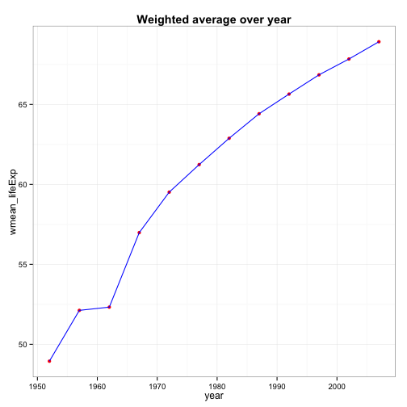</td></tr></table>

* TASK NO4: How is life expectancy changing over time on different continents?


```r
# use weighted average lifeExp here
lifeExp_mean <- gtbl %>%
  group_by(continent, year) %>%
  summarize(wmean_lifeExp= weighted.mean(lifeExp,pop))
```

<table class='container'><tr><td>

<table>
<thead>
<tr class="header">
<th align="left">continent</th>
<th align="right">year</th>
<th align="right">wmean_lifeExp</th>
</tr>
</thead>
<tbody>
<tr class="odd">
<td align="left">Africa</td>
<td align="right">1952</td>
<td align="right">38.80</td>
</tr>
<tr class="even">
<td align="left">Africa</td>
<td align="right">1957</td>
<td align="right">40.94</td>
</tr>
<tr class="odd">
<td align="left">Africa</td>
<td align="right">1962</td>
<td align="right">43.10</td>
</tr>
<tr class="even">
<td align="left">Africa</td>
<td align="right">1967</td>
<td align="right">45.18</td>
</tr>
<tr class="odd">
<td align="left">Africa</td>
<td align="right">1972</td>
<td align="right">47.21</td>
</tr>
<tr class="even">
<td align="left">Africa</td>
<td align="right">1977</td>
<td align="right">49.21</td>
</tr>
<tr class="odd">
<td align="left">Africa</td>
<td align="right">1982</td>
<td align="right">51.02</td>
</tr>
<tr class="even">
<td align="left">Africa</td>
<td align="right">1987</td>
<td align="right">52.82</td>
</tr>
<tr class="odd">
<td align="left">Africa</td>
<td align="right">1992</td>
<td align="right">53.37</td>
</tr>
<tr class="even">
<td align="left">Africa</td>
<td align="right">1997</td>
<td align="right">53.28</td>
</tr>
<tr class="odd">
<td align="left">Africa</td>
<td align="right">2002</td>
<td align="right">53.30</td>
</tr>
<tr class="even">
<td align="left">Africa</td>
<td align="right">2007</td>
<td align="right">54.56</td>
</tr>
<tr class="odd">
<td align="left">Americas</td>
<td align="right">1952</td>
<td align="right">60.24</td>
</tr>
<tr class="even">
<td align="left">Americas</td>
<td align="right">1957</td>
<td align="right">62.02</td>
</tr>
<tr class="odd">
<td align="left">Americas</td>
<td align="right">1962</td>
<td align="right">63.44</td>
</tr>
<tr class="even">
<td align="left">Americas</td>
<td align="right">1967</td>
<td align="right">64.51</td>
</tr>
<tr class="odd">
<td align="left">Americas</td>
<td align="right">1972</td>
<td align="right">65.70</td>
</tr>
<tr class="even">
<td align="left">Americas</td>
<td align="right">1977</td>
<td align="right">67.61</td>
</tr>
<tr class="odd">
<td align="left">Americas</td>
<td align="right">1982</td>
<td align="right">69.19</td>
</tr>
<tr class="even">
<td align="left">Americas</td>
<td align="right">1987</td>
<td align="right">70.36</td>
</tr>
<tr class="odd">
<td align="left">Americas</td>
<td align="right">1992</td>
<td align="right">71.72</td>
</tr>
<tr class="even">
<td align="left">Americas</td>
<td align="right">1997</td>
<td align="right">73.19</td>
</tr>
<tr class="odd">
<td align="left">Americas</td>
<td align="right">2002</td>
<td align="right">74.25</td>
</tr>
<tr class="even">
<td align="left">Americas</td>
<td align="right">2007</td>
<td align="right">75.36</td>
</tr>
<tr class="odd">
<td align="left">Asia</td>
<td align="right">1952</td>
<td align="right">42.94</td>
</tr>
<tr class="even">
<td align="left">Asia</td>
<td align="right">1957</td>
<td align="right">47.29</td>
</tr>
<tr class="odd">
<td align="left">Asia</td>
<td align="right">1962</td>
<td align="right">46.57</td>
</tr>
<tr class="even">
<td align="left">Asia</td>
<td align="right">1967</td>
<td align="right">53.88</td>
</tr>
<tr class="odd">
<td align="left">Asia</td>
<td align="right">1972</td>
<td align="right">57.52</td>
</tr>
<tr class="even">
<td align="left">Asia</td>
<td align="right">1977</td>
<td align="right">59.56</td>
</tr>
<tr class="odd">
<td align="left">Asia</td>
<td align="right">1982</td>
<td align="right">61.57</td>
</tr>
<tr class="even">
<td align="left">Asia</td>
<td align="right">1987</td>
<td align="right">63.54</td>
</tr>
<tr class="odd">
<td align="left">Asia</td>
<td align="right">1992</td>
<td align="right">65.15</td>
</tr>
<tr class="even">
<td align="left">Asia</td>
<td align="right">1997</td>
<td align="right">66.77</td>
</tr>
<tr class="odd">
<td align="left">Asia</td>
<td align="right">2002</td>
<td align="right">68.14</td>
</tr>
<tr class="even">
<td align="left">Asia</td>
<td align="right">2007</td>
<td align="right">69.44</td>
</tr>
<tr class="odd">
<td align="left">Europe</td>
<td align="right">1952</td>
<td align="right">64.91</td>
</tr>
<tr class="even">
<td align="left">Europe</td>
<td align="right">1957</td>
<td align="right">66.89</td>
</tr>
<tr class="odd">
<td align="left">Europe</td>
<td align="right">1962</td>
<td align="right">68.46</td>
</tr>
<tr class="even">
<td align="left">Europe</td>
<td align="right">1967</td>
<td align="right">69.55</td>
</tr>
<tr class="odd">
<td align="left">Europe</td>
<td align="right">1972</td>
<td align="right">70.47</td>
</tr>
<tr class="even">
<td align="left">Europe</td>
<td align="right">1977</td>
<td align="right">71.54</td>
</tr>
<tr class="odd">
<td align="left">Europe</td>
<td align="right">1982</td>
<td align="right">72.56</td>
</tr>
<tr class="even">
<td align="left">Europe</td>
<td align="right">1987</td>
<td align="right">73.45</td>
</tr>
<tr class="odd">
<td align="left">Europe</td>
<td align="right">1992</td>
<td align="right">74.44</td>
</tr>
<tr class="even">
<td align="left">Europe</td>
<td align="right">1997</td>
<td align="right">75.71</td>
</tr>
<tr class="odd">
<td align="left">Europe</td>
<td align="right">2002</td>
<td align="right">77.02</td>
</tr>
<tr class="even">
<td align="left">Europe</td>
<td align="right">2007</td>
<td align="right">77.89</td>
</tr>
<tr class="odd">
<td align="left">Oceania</td>
<td align="right">1952</td>
<td align="right">69.17</td>
</tr>
<tr class="even">
<td align="left">Oceania</td>
<td align="right">1957</td>
<td align="right">70.32</td>
</tr>
<tr class="odd">
<td align="left">Oceania</td>
<td align="right">1962</td>
<td align="right">70.99</td>
</tr>
<tr class="even">
<td align="left">Oceania</td>
<td align="right">1967</td>
<td align="right">71.18</td>
</tr>
<tr class="odd">
<td align="left">Oceania</td>
<td align="right">1972</td>
<td align="right">71.92</td>
</tr>
<tr class="even">
<td align="left">Oceania</td>
<td align="right">1977</td>
<td align="right">73.26</td>
</tr>
<tr class="odd">
<td align="left">Oceania</td>
<td align="right">1982</td>
<td align="right">74.58</td>
</tr>
<tr class="even">
<td align="left">Oceania</td>
<td align="right">1987</td>
<td align="right">75.98</td>
</tr>
<tr class="odd">
<td align="left">Oceania</td>
<td align="right">1992</td>
<td align="right">77.36</td>
</tr>
<tr class="even">
<td align="left">Oceania</td>
<td align="right">1997</td>
<td align="right">78.62</td>
</tr>
<tr class="odd">
<td align="left">Oceania</td>
<td align="right">2002</td>
<td align="right">80.16</td>
</tr>
<tr class="even">
<td align="left">Oceania</td>
<td align="right">2007</td>
<td align="right">81.06</td>
</tr>
</tbody>
</table>
</td><td>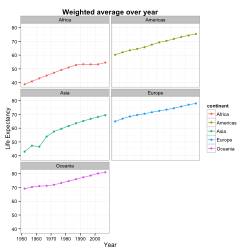</td></tr></table>

* TASK NO5: Report the absolute and/or relative abundance of countries
  with low life expectancy over time by continent: Compute some 
  measure of worldwide life expectancy – you decide – a mean or
 median or some other quantile or perhaps your current age. 
 The determine how many countries on each continent have a life 
 expectancy less than this benchmark, for each year.
 

```r
# use median as benchmark
benchmark<-median(gtbl$lifeExp) 
lifeExp_abu<-gtbl %>%
  group_by(continent, year) %>%
  filter(lifeExp < benchmark) %>%
  summarize(n_countries = n_distinct(country))
```
<table class='container'><tr><td>

<table>
<thead>
<tr class="header">
<th align="left">continent</th>
<th align="right">year</th>
<th align="right">n_countries</th>
</tr>
</thead>
<tbody>
<tr class="odd">
<td align="left">Africa</td>
<td align="right">1952</td>
<td align="right">52</td>
</tr>
<tr class="even">
<td align="left">Africa</td>
<td align="right">1957</td>
<td align="right">52</td>
</tr>
<tr class="odd">
<td align="left">Africa</td>
<td align="right">1962</td>
<td align="right">52</td>
</tr>
<tr class="even">
<td align="left">Africa</td>
<td align="right">1967</td>
<td align="right">51</td>
</tr>
<tr class="odd">
<td align="left">Africa</td>
<td align="right">1972</td>
<td align="right">50</td>
</tr>
<tr class="even">
<td align="left">Africa</td>
<td align="right">1977</td>
<td align="right">50</td>
</tr>
<tr class="odd">
<td align="left">Africa</td>
<td align="right">1982</td>
<td align="right">46</td>
</tr>
<tr class="even">
<td align="left">Africa</td>
<td align="right">1987</td>
<td align="right">41</td>
</tr>
<tr class="odd">
<td align="left">Africa</td>
<td align="right">1992</td>
<td align="right">40</td>
</tr>
<tr class="even">
<td align="left">Africa</td>
<td align="right">1997</td>
<td align="right">44</td>
</tr>
<tr class="odd">
<td align="left">Africa</td>
<td align="right">2002</td>
<td align="right">41</td>
</tr>
<tr class="even">
<td align="left">Africa</td>
<td align="right">2007</td>
<td align="right">41</td>
</tr>
<tr class="odd">
<td align="left">Americas</td>
<td align="right">1952</td>
<td align="right">19</td>
</tr>
<tr class="even">
<td align="left">Americas</td>
<td align="right">1957</td>
<td align="right">16</td>
</tr>
<tr class="odd">
<td align="left">Americas</td>
<td align="right">1962</td>
<td align="right">13</td>
</tr>
<tr class="even">
<td align="left">Americas</td>
<td align="right">1967</td>
<td align="right">13</td>
</tr>
<tr class="odd">
<td align="left">Americas</td>
<td align="right">1972</td>
<td align="right">10</td>
</tr>
<tr class="even">
<td align="left">Americas</td>
<td align="right">1977</td>
<td align="right">7</td>
</tr>
<tr class="odd">
<td align="left">Americas</td>
<td align="right">1982</td>
<td align="right">5</td>
</tr>
<tr class="even">
<td align="left">Americas</td>
<td align="right">1987</td>
<td align="right">2</td>
</tr>
<tr class="odd">
<td align="left">Americas</td>
<td align="right">1992</td>
<td align="right">2</td>
</tr>
<tr class="even">
<td align="left">Americas</td>
<td align="right">1997</td>
<td align="right">1</td>
</tr>
<tr class="odd">
<td align="left">Americas</td>
<td align="right">2002</td>
<td align="right">1</td>
</tr>
<tr class="even">
<td align="left">Asia</td>
<td align="right">1952</td>
<td align="right">30</td>
</tr>
<tr class="odd">
<td align="left">Asia</td>
<td align="right">1957</td>
<td align="right">27</td>
</tr>
<tr class="even">
<td align="left">Asia</td>
<td align="right">1962</td>
<td align="right">26</td>
</tr>
<tr class="odd">
<td align="left">Asia</td>
<td align="right">1967</td>
<td align="right">25</td>
</tr>
<tr class="even">
<td align="left">Asia</td>
<td align="right">1972</td>
<td align="right">20</td>
</tr>
<tr class="odd">
<td align="left">Asia</td>
<td align="right">1977</td>
<td align="right">16</td>
</tr>
<tr class="even">
<td align="left">Asia</td>
<td align="right">1982</td>
<td align="right">12</td>
</tr>
<tr class="odd">
<td align="left">Asia</td>
<td align="right">1987</td>
<td align="right">10</td>
</tr>
<tr class="even">
<td align="left">Asia</td>
<td align="right">1992</td>
<td align="right">8</td>
</tr>
<tr class="odd">
<td align="left">Asia</td>
<td align="right">1997</td>
<td align="right">7</td>
</tr>
<tr class="even">
<td align="left">Asia</td>
<td align="right">2002</td>
<td align="right">5</td>
</tr>
<tr class="odd">
<td align="left">Asia</td>
<td align="right">2007</td>
<td align="right">3</td>
</tr>
<tr class="even">
<td align="left">Europe</td>
<td align="right">1952</td>
<td align="right">7</td>
</tr>
<tr class="odd">
<td align="left">Europe</td>
<td align="right">1957</td>
<td align="right">3</td>
</tr>
<tr class="even">
<td align="left">Europe</td>
<td align="right">1962</td>
<td align="right">1</td>
</tr>
<tr class="odd">
<td align="left">Europe</td>
<td align="right">1967</td>
<td align="right">1</td>
</tr>
<tr class="even">
<td align="left">Europe</td>
<td align="right">1972</td>
<td align="right">1</td>
</tr>
<tr class="odd">
<td align="left">Europe</td>
<td align="right">1977</td>
<td align="right">1</td>
</tr>
</tbody>
</table>
</td><td>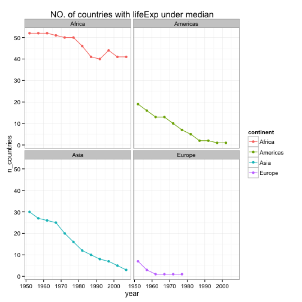</td></tr></table>

* TASK NO6: Find countries with interesting stories.


```r
gtbl %>%
  filter(continent == "Asia") %>%
  select(year, country, lifeExp) %>%
  arrange(year) %>%
  group_by(year) %>%
  filter(min_rank(desc(lifeExp)) < 2 | min_rank(lifeExp) < 2)
```

```
## Source: local data frame [24 x 3]
## Groups: year
## 
##    year     country lifeExp
## 1  1952 Afghanistan   28.80
## 2  1952      Israel   65.39
## 3  1957 Afghanistan   30.33
## 4  1957      Israel   67.84
## 5  1962 Afghanistan   32.00
## 6  1962      Israel   69.39
## 7  1967 Afghanistan   34.02
## 8  1967       Japan   71.43
## 9  1972 Afghanistan   36.09
## 10 1972       Japan   73.42
## 11 1977    Cambodia   31.22
## 12 1977       Japan   75.38
## 13 1982 Afghanistan   39.85
## 14 1982       Japan   77.11
## 15 1987 Afghanistan   40.82
## 16 1987       Japan   78.67
## 17 1992 Afghanistan   41.67
## 18 1992       Japan   79.36
## 19 1997 Afghanistan   41.76
## 20 1997       Japan   80.69
## 21 2002 Afghanistan   42.13
## 22 2002       Japan   82.00
## 23 2007 Afghanistan   43.83
## 24 2007       Japan   82.60
```

We see that (min = Afghanistan, max = Japan) is the most frequent result.

```r
#Compare Afghanistan, Japan and world average
data_avg<- gtbl %>%
  group_by(year) %>%
  summarize(lifeExp= mean(lifeExp))
data_life<-tbl_df(data.frame(year = data_avg$year, 
                             Jap = filter(gtbl, country == "Japan")$lifeExp,
                             Afg = filter(gtbl, country == "Afghanistan")$lifeExp,
                             Avg = data_avg$lifeExp))
```
<table class='container'><tr><td>

<table>
<thead>
<tr class="header">
<th align="right">year</th>
<th align="right">Jap</th>
<th align="right">Afg</th>
<th align="right">Avg</th>
</tr>
</thead>
<tbody>
<tr class="odd">
<td align="right">1952</td>
<td align="right">63.03</td>
<td align="right">28.80</td>
<td align="right">49.06</td>
</tr>
<tr class="even">
<td align="right">1957</td>
<td align="right">65.50</td>
<td align="right">30.33</td>
<td align="right">51.51</td>
</tr>
<tr class="odd">
<td align="right">1962</td>
<td align="right">68.73</td>
<td align="right">32.00</td>
<td align="right">53.61</td>
</tr>
<tr class="even">
<td align="right">1967</td>
<td align="right">71.43</td>
<td align="right">34.02</td>
<td align="right">55.68</td>
</tr>
<tr class="odd">
<td align="right">1972</td>
<td align="right">73.42</td>
<td align="right">36.09</td>
<td align="right">57.65</td>
</tr>
<tr class="even">
<td align="right">1977</td>
<td align="right">75.38</td>
<td align="right">38.44</td>
<td align="right">59.57</td>
</tr>
<tr class="odd">
<td align="right">1982</td>
<td align="right">77.11</td>
<td align="right">39.85</td>
<td align="right">61.53</td>
</tr>
<tr class="even">
<td align="right">1987</td>
<td align="right">78.67</td>
<td align="right">40.82</td>
<td align="right">63.21</td>
</tr>
<tr class="odd">
<td align="right">1992</td>
<td align="right">79.36</td>
<td align="right">41.67</td>
<td align="right">64.16</td>
</tr>
<tr class="even">
<td align="right">1997</td>
<td align="right">80.69</td>
<td align="right">41.76</td>
<td align="right">65.01</td>
</tr>
<tr class="odd">
<td align="right">2002</td>
<td align="right">82.00</td>
<td align="right">42.13</td>
<td align="right">65.69</td>
</tr>
<tr class="even">
<td align="right">2007</td>
<td align="right">82.60</td>
<td align="right">43.83</td>
<td align="right">67.01</td>
</tr>
</tbody>
</table>
</td><td>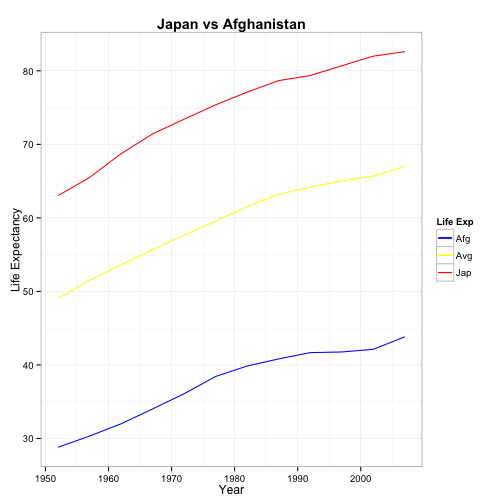</td></tr></table>


Next, we want to find the country experiencing the sharpest 5-year drop in life expectancy.


```r
gtbl %>%
  group_by(continent, country) %>%
  select(country, year, continent, lifeExp) %>%
  mutate(le_delta = lifeExp - lag(lifeExp)) %>%
  summarize(worst_le_delta = min(le_delta, na.rm = TRUE)) %>%
  filter(min_rank(worst_le_delta) < 2) %>%
  arrange(worst_le_delta)
```

```
## Source: local data frame [5 x 3]
## Groups: continent
## 
##   continent     country worst_le_delta
## 1    Africa      Rwanda        -20.421
## 2      Asia    Cambodia         -9.097
## 3  Americas El Salvador         -1.511
## 4    Europe  Montenegro         -1.464
## 5   Oceania   Australia          0.170
```

For above five countries, we have:

```r
data_drop <- tbl_df(data.frame(year = data_avg$year, 
                               Rwa = filter(gtbl, country == "Rwanda")$lifeExp,
                               Cam = filter(gtbl, country == "Cambodia")$lifeExp,
                               ES  = filter(gtbl, country == "El Salvador")$lifeExp,
                               Mon = filter(gtbl, country == "Montenegro")$lifeExp,
                               Aus = filter(gtbl, country == "Australia")$lifeExp,
                               Avg = data_avg$lifeExp))
```
<table class='container'><tr><td>

<table>
<thead>
<tr class="header">
<th align="right">year</th>
<th align="right">Rwa</th>
<th align="right">Cam</th>
<th align="right">ES</th>
<th align="right">Mon</th>
<th align="right">Aus</th>
<th align="right">Avg</th>
</tr>
</thead>
<tbody>
<tr class="odd">
<td align="right">1952</td>
<td align="right">40.00</td>
<td align="right">39.42</td>
<td align="right">45.26</td>
<td align="right">59.16</td>
<td align="right">69.12</td>
<td align="right">49.06</td>
</tr>
<tr class="even">
<td align="right">1957</td>
<td align="right">41.50</td>
<td align="right">41.37</td>
<td align="right">48.57</td>
<td align="right">61.45</td>
<td align="right">70.33</td>
<td align="right">51.51</td>
</tr>
<tr class="odd">
<td align="right">1962</td>
<td align="right">43.00</td>
<td align="right">43.41</td>
<td align="right">52.31</td>
<td align="right">63.73</td>
<td align="right">70.93</td>
<td align="right">53.61</td>
</tr>
<tr class="even">
<td align="right">1967</td>
<td align="right">44.10</td>
<td align="right">45.41</td>
<td align="right">55.85</td>
<td align="right">67.18</td>
<td align="right">71.10</td>
<td align="right">55.68</td>
</tr>
<tr class="odd">
<td align="right">1972</td>
<td align="right">44.60</td>
<td align="right">40.32</td>
<td align="right">58.21</td>
<td align="right">70.64</td>
<td align="right">71.93</td>
<td align="right">57.65</td>
</tr>
<tr class="even">
<td align="right">1977</td>
<td align="right">45.00</td>
<td align="right">31.22</td>
<td align="right">56.70</td>
<td align="right">73.07</td>
<td align="right">73.49</td>
<td align="right">59.57</td>
</tr>
<tr class="odd">
<td align="right">1982</td>
<td align="right">46.22</td>
<td align="right">50.96</td>
<td align="right">56.60</td>
<td align="right">74.10</td>
<td align="right">74.74</td>
<td align="right">61.53</td>
</tr>
<tr class="even">
<td align="right">1987</td>
<td align="right">44.02</td>
<td align="right">53.91</td>
<td align="right">63.15</td>
<td align="right">74.86</td>
<td align="right">76.32</td>
<td align="right">63.21</td>
</tr>
<tr class="odd">
<td align="right">1992</td>
<td align="right">23.60</td>
<td align="right">55.80</td>
<td align="right">66.80</td>
<td align="right">75.44</td>
<td align="right">77.56</td>
<td align="right">64.16</td>
</tr>
<tr class="even">
<td align="right">1997</td>
<td align="right">36.09</td>
<td align="right">56.53</td>
<td align="right">69.53</td>
<td align="right">75.44</td>
<td align="right">78.83</td>
<td align="right">65.01</td>
</tr>
<tr class="odd">
<td align="right">2002</td>
<td align="right">43.41</td>
<td align="right">56.75</td>
<td align="right">70.73</td>
<td align="right">73.98</td>
<td align="right">80.37</td>
<td align="right">65.69</td>
</tr>
<tr class="even">
<td align="right">2007</td>
<td align="right">46.24</td>
<td align="right">59.72</td>
<td align="right">71.88</td>
<td align="right">74.54</td>
<td align="right">81.23</td>
<td align="right">67.01</td>
</tr>
</tbody>
</table>
</td><td>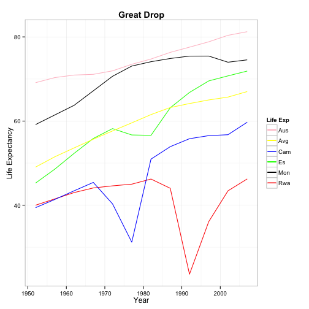</td></tr></table>

We also want a special analysis of Rwanda.

```r
# analysis for Rwanda
data_Rwa = gtbl %>% filter(country == "Rwanda")
```
<table class='container'><tr><td>

<table>
<thead>
<tr class="header">
<th align="left">country</th>
<th align="right">year</th>
<th align="right">pop</th>
<th align="left">continent</th>
<th align="right">lifeExp</th>
<th align="right">gdpPercap</th>
</tr>
</thead>
<tbody>
<tr class="odd">
<td align="left">Rwanda</td>
<td align="right">1952</td>
<td align="right">2534927</td>
<td align="left">Africa</td>
<td align="right">40.00</td>
<td align="right">493.3</td>
</tr>
<tr class="even">
<td align="left">Rwanda</td>
<td align="right">1957</td>
<td align="right">2822082</td>
<td align="left">Africa</td>
<td align="right">41.50</td>
<td align="right">540.3</td>
</tr>
<tr class="odd">
<td align="left">Rwanda</td>
<td align="right">1962</td>
<td align="right">3051242</td>
<td align="left">Africa</td>
<td align="right">43.00</td>
<td align="right">597.5</td>
</tr>
<tr class="even">
<td align="left">Rwanda</td>
<td align="right">1967</td>
<td align="right">3451079</td>
<td align="left">Africa</td>
<td align="right">44.10</td>
<td align="right">511.0</td>
</tr>
<tr class="odd">
<td align="left">Rwanda</td>
<td align="right">1972</td>
<td align="right">3992121</td>
<td align="left">Africa</td>
<td align="right">44.60</td>
<td align="right">590.6</td>
</tr>
<tr class="even">
<td align="left">Rwanda</td>
<td align="right">1977</td>
<td align="right">4657072</td>
<td align="left">Africa</td>
<td align="right">45.00</td>
<td align="right">670.1</td>
</tr>
<tr class="odd">
<td align="left">Rwanda</td>
<td align="right">1982</td>
<td align="right">5507565</td>
<td align="left">Africa</td>
<td align="right">46.22</td>
<td align="right">881.6</td>
</tr>
<tr class="even">
<td align="left">Rwanda</td>
<td align="right">1987</td>
<td align="right">6349365</td>
<td align="left">Africa</td>
<td align="right">44.02</td>
<td align="right">848.0</td>
</tr>
<tr class="odd">
<td align="left">Rwanda</td>
<td align="right">1992</td>
<td align="right">7290203</td>
<td align="left">Africa</td>
<td align="right">23.60</td>
<td align="right">737.1</td>
</tr>
<tr class="even">
<td align="left">Rwanda</td>
<td align="right">1997</td>
<td align="right">7212583</td>
<td align="left">Africa</td>
<td align="right">36.09</td>
<td align="right">589.9</td>
</tr>
<tr class="odd">
<td align="left">Rwanda</td>
<td align="right">2002</td>
<td align="right">7852401</td>
<td align="left">Africa</td>
<td align="right">43.41</td>
<td align="right">785.7</td>
</tr>
<tr class="even">
<td align="left">Rwanda</td>
<td align="right">2007</td>
<td align="right">8860588</td>
<td align="left">Africa</td>
<td align="right">46.24</td>
<td align="right">863.1</td>
</tr>
</tbody>
</table>
</td><td>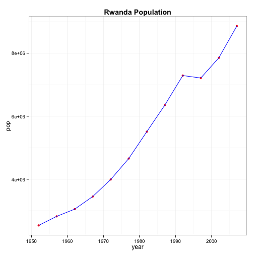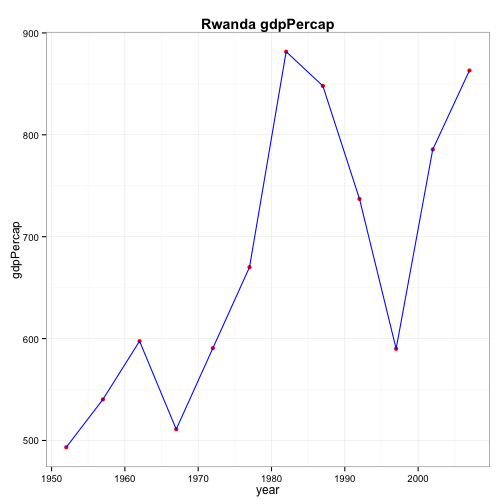</td></tr></table>
We notice that population and Gdp also experienced a big decrease in 1990s. After googling, we think the reason must be [_Rwandan Genocide_](http://en.wikipedia.org/wiki/Rwandan_Genocide).

# My experience and workflow
1. `dplyr` is indeed a power tool for the analysis. Some of its grammer are similar that of `sql`. With some experience of using sql, I think I am really quick in understanding the functions in `dplyr`.
2. This time we continue our application of `ggplot`. One preblem I meet is to draw a bar graph with the data in two columns side-by-side. Although I have already learned about `position="dodge"`, it still took me some time as I finally found I need to resharp the data. See [this](http://stackoverflow.com/questions/13250872/reshaping-data-to-plot-in-r-using-ggplot2) on stackoverflow for more detail.
3. To acheive the task of put a figure and relevant table right next to each other. It need some code in html. The following code may help if anyone need

```r
#```{r, results='asis', echo=FALSE, out.extra=''}
#cat("<table class='container'><tr>")
#cat("<td>")
#kable(data_Rwa)
#cat("</td>")
#cat("<td>")
#ggplot(data_Rwa, aes(year, pop)) +
#  ggtitle("Rwanda Population")+
#  geom_point(color="red")+
#  geom_line(color="blue")+
#  theme_bw()+
#  theme(plot.title = element_text(lineheight=.8, face="bold"))
#ggplot(data_Rwa, aes(year, gdpPercap)) +
#  ggtitle("Rwanda gdpPercap")+
#  geom_point(color="red")+
#  geom_line(color="blue")+
#  theme_bw()+
#  theme(plot.title = element_text(lineheight=.8, face="bold"))
#cat("</td>")
#cat("</tr></table>")
#```
```
