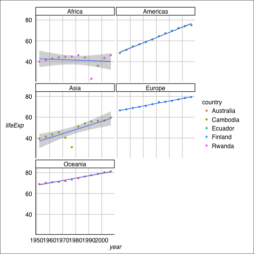
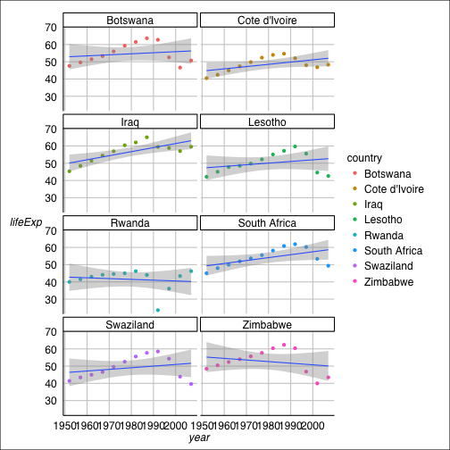
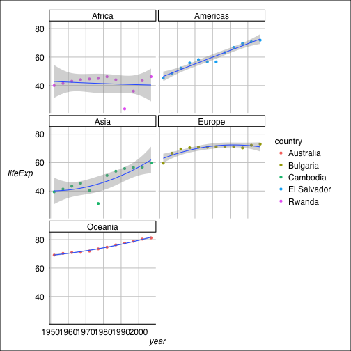

In this part, we will use the the function we developed in [function building](website), and continue our exploration of the the data set [Gapminder excerpt](http://www.stat.ubc.ca/~jenny/notOcto/STAT545A/examples/gapminder/data/gapminderDataFiveYear.txt). 

# Preparation
Before preceeding to the exciting parts, we need some preparation like loading the data and library, and setting function.


```r
# load the data
gdURL <-"http://tiny.cc/gapminder"
gDat <- read.delim(file = gdURL)

# load the library
library(plyr)
library(dplyr)
library(ggplot2)
library(ggthemes)
library(knitr)
library(reshape2)

# change data.frame to tbl_df 
gtbl <- tbl_df(gDat)
glimpse(gtbl)
```

```
## Variables:
## $ country   (fctr) Afghanistan, Afghanistan, Afghanistan, Afghanistan,...
## $ year      (int) 1952, 1957, 1962, 1967, 1972, 1977, 1982, 1987, 1992...
## $ pop       (dbl) 8425333, 9240934, 10267083, 11537966, 13079460, 1488...
## $ continent (fctr) Asia, Asia, Asia, Asia, Asia, Asia, Asia, Asia, Asi...
## $ lifeExp   (dbl) 28.80, 30.33, 32.00, 34.02, 36.09, 38.44, 39.85, 40....
## $ gdpPercap (dbl) 779.4, 820.9, 853.1, 836.2, 740.0, 786.1, 978.0, 852...
```

```r
# set the function
my.lm.int <- function(x) {
  if(!is.numeric(x$year)|!is.numeric(x$lifeExp)) {
    stop('I am so sorry, but this function only works for numeric input!')
  }
  jFit <- lm(lifeExp ~ I(year - min(x$year)), x)
  jCoef <- coef(jFit)
  names(jCoef) <- NULL
  return(c(intercept = jCoef[1],
           slope = jCoef[2],
           maxResid = max(abs(resid(jFit)))/summary(jFit)$sigma))
  }

my.lmrob.int <- function(x) {
  if(!is.numeric(x$year)|!is.numeric(x$lifeExp)) {
    stop('I am so sorry, but this function only works for numeric input!')
  }
  library(robustbase)
  jFit <- lm(lifeExp ~ I(year - min(x$year)), x)
  jCoef <- coef(jFit)
  names(jCoef) <- NULL
  rFit <- lmrob(lifeExp ~ I(year - min(x$year)), x)
  rCoef <- coef(rFit)
  names(rCoef) <- NULL
  return(c(intercept = jCoef[1],
           slope = jCoef[2],
           dist = 100*sum(abs((jCoef-rCoef)/jCoef))))
  # we use the percentage from OLS as distance
  }

quadresid<-function(x, y){
  if(!is.numeric(x)|!is.numeric(y)) {
    stop('I am so sorry, but this function only works for numeric input!')
  }
  jFit <- lm(y ~ I(x-min(x))+I((x-min(x))^2))
  return(
    max(abs(resid(jFit)))
    )
}
```

# Find the countries with interest stories: residuals
We will start our process of exploring the data set. First we use the function `my.lm.int`. We are going to find the country with max residual within each continent.

```r
maxResids <- ddply(gDat, ~ country + continent, my.lm.int)
intcon <- ddply(maxResids, ~ continent, function(x) {
  theMax <- which.max(x$maxResid)
  x[theMax, ]
  })

kable(intcon)
```

```
## 
## 
## |country   |continent | intercept|   slope| maxResid|
## |:---------|:---------|---------:|-------:|--------:|
## |Rwanda    |Africa    |     42.74| -0.0458|    2.639|
## |Ecuador   |Americas  |     49.07|  0.5001|    2.253|
## |Cambodia  |Asia      |     37.02|  0.3959|    2.787|
## |Finland   |Europe    |     66.45|  0.2379|    2.719|
## |Australia |Oceania   |     68.40|  0.2277|    1.652|
```

```r
ggplot(subset(gDat, country %in% intcon$country),aes(x = year, y = lifeExp))+
  geom_point(aes(colour  = country))+
  geom_smooth(method = "lm")+
  facet_wrap( ~ continent,ncol = 2)+
  theme_gdocs()
```

 

# Find the countries with interest stories: robust regression
In this part, we will use the function my.lmrob.int to find the interesting countries. In this part, we find the countries with top 5% dist between coef of OLS and robust regression. Thus we will use the function `dlply` and `ldply`.


```r
diffrob <- dlply(gDat, .(country) , my.lmrob.int)
```

```
## Warning: find_scale() did not converge in 'maxit.scale' (= 200) iterations
## Warning: find_scale() did not converge in 'maxit.scale' (= 200) iterations
## Warning: find_scale() did not converge in 'maxit.scale' (= 200) iterations
## Warning: find_scale() did not converge in 'maxit.scale' (= 200) iterations
## Warning: find_scale() did not converge in 'maxit.scale' (= 200) iterations
## Warning: find_scale() did not converge in 'maxit.scale' (= 200) iterations
## Warning: find_scale() did not converge in 'maxit.scale' (= 200) iterations
## Warning: find_scale() did not converge in 'maxit.scale' (= 200) iterations
## Warning: find_scale() did not converge in 'maxit.scale' (= 200) iterations
## Warning: find_scale() did not converge in 'maxit.scale' (= 200) iterations
## Warning: find_scale() did not converge in 'maxit.scale' (= 200) iterations
## Warning: find_scale() did not converge in 'maxit.scale' (= 200) iterations
## Warning: find_scale() did not converge in 'maxit.scale' (= 200) iterations
## Warning: find_scale() did not converge in 'maxit.scale' (= 200) iterations
## Warning: find_scale() did not converge in 'maxit.scale' (= 200) iterations
```

```r
diffcon <- ldply(diffrob,  function(x){return(x[3])})

intcor <-diffcon[diffcon$dist>quantile(diffcon$dist, probs = 0.95), ]
kable(intcor)
```

```
## 
## 
## |    |country       |  dist|
## |:---|:-------------|-----:|
## |14  |Botswana      | 623.7|
## |31  |Cote d'Ivoire | 206.6|
## |62  |Iraq          | 147.1|
## |74  |Lesotho       | 342.4|
## |108 |Rwanda        | 247.3|
## |118 |South Africa  | 156.1|
## |122 |Swaziland     | 395.8|
## |142 |Zimbabwe      | 513.4|
```

```r
ggplot(subset(gDat, country %in% intcor$country),aes(x = year, y = lifeExp))+
  geom_point(aes(colour  = country))+
  geom_smooth(method = "lm")+
  facet_wrap( ~ country,ncol = 2)+
  theme_gdocs()
```

 


# Find the countries with interest stories: quadric regression
Here we will use quadric regression to find the countries with largest residual within each continent. And we will use dplyr as our data aggregation tool

```r
resid.quad<-gtbl %>%
  group_by(continent, country) %>%
  select(country, year, continent, lifeExp) %>%
  summarize(resid = quadresid(year, lifeExp))%>%
  filter(min_rank(desc(resid)) < 2) %>%
  arrange(resid)
kable(resid.quad)
```

```
## 
## 
## |continent |country     |   resid|
## |:---------|:-----------|-------:|
## |Oceania   |Australia   |  0.6091|
## |Europe    |Bulgaria    |  3.4055|
## |Americas  |El Salvador |  4.2890|
## |Asia      |Cambodia    | 13.7233|
## |Africa    |Rwanda      | 17.2648|
```

```r
ggplot(subset(gDat, country %in% resid.quad$country),aes(x = year, y = lifeExp))+
  geom_point(aes(colour  = country))+
  geom_smooth(method = "lm", formula = y ~ poly(x, 2))+
  facet_wrap( ~ continent,ncol = 2)+
  theme_gdocs()
```

 

# My experience and workflow
1. `plyr` is a powerful tool for data aggregation tool, and unlike `dplyr`, it is more flexible, as it can deal with not only dataframe, but also list and array. There are some other difference in `plyr` and `dplyr`. For example, `plyr` need function for dataset, but `dplyr` need function for variables.
2. Learning how to use `ldply` is a challenging but interesting task. The main difference is that list will not accept two group variable. Reading [help document](http://www.inside-r.org/packages/cran/plyr/docs/ddply) of 'dlply' will help a lot.
3. After exploring the residuals of linear regression and quadratic regression, we find two changes in countries: Americas Ecuador -> ELSavador; Europe Finland -> Bulgaria. We can at least conclude that using quadratic regression has a large improvment in fitting the data about Ecuador and Finland. Which one is better as a general model for these data set need further study.

